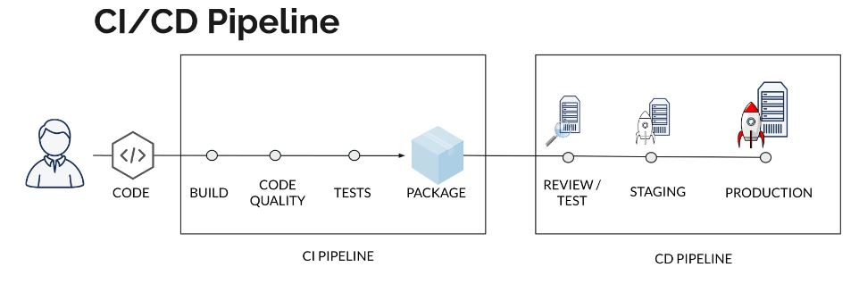
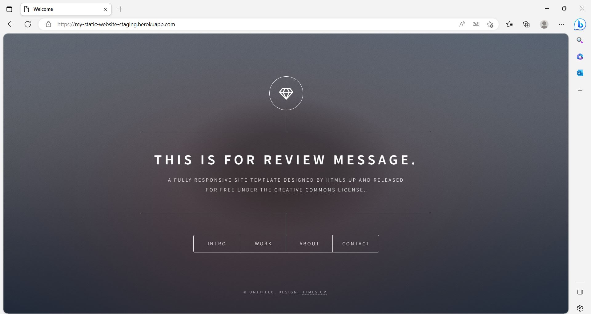

# Mini project Gitlab CI

Ce projet a pour but de mettre en pratique les connaissances de mise en place d'un pipeline CI/CD avec Gitlab afin d'automatiser les étapes de build, de test et de deploiement d'une application web statique en staging et prod sur un environnement Cloud Heroku. Ce rapport explique les étapes du pipeline sous un fichier _`.gitlab-ci.yml`_ ainsi que les avantages de cette approche.

## Aperçu du pipeline CI/CD

## Workflow du pipeline

- **Build image**
    - _Condition_ : S'éxecute pour chaque commit sur la branche principale.
    - Construit l'image Docker de l'application en utilisant le Dockerfile crée ci - dessus.
    - Sauvegarde l'image buildée sous forme d'artefact réutilisable dans un fichier _`static-website.tar`_.
 

- **Acceptance test**
    - _Condition_ : S'éxecute pour chaque commit sur la branche principale.
    - Charge l'image buildée à partir de l'artefact, puis déploie l'image sur un conteneur.
    - Effectue des tests d'acceptance de l'image Docker buildée en lançant une requête HTTP afin de vérifier le contenu.

- **Release image**
    - _Condition_ : S'éxecute pour chaque commit sur la branche principale.
    - Charge l'image buildée à partir de l'artefact, puis déploie l'image sur un conteneur.
    - Tag l'image avec le nom de la branche et le commit SHA.
    - Publie l'image buildée sur notre registre Gitlab.

- **Deploy review**
    - _Condition_ : S'éxecute pour chaque nouvelle _`merge_request`_.
    - Déploie l'application dans un environnement de review sur Heroku pour chaque merge request.

- **Test review**
    - _Condition_ : S'éxecute pour chaque nouvelle _`merge_request`_.
    - Effectue un test de review de l'application en lançant une requête HTTP afin de vérifier le contenu.

- **Stop review**
    - _Condition_ : S'éxecute lorsqu'une _`merge_request`_ est validée ou fermée.
    - Supprime l'environnement de review chargé sur Heroku afin de libérer les ressources allouées.

- **Deploy staging**
    - _Condition_ : S'éxecute pour chaque commit sur la branche principale.
    - Déploie l'application sur un environnement de préproduction (staging) sur Heroku.

- **Test staging**
    - _Condition_ : S'éxecute après le déploiement en staging.
    - Effectue un test d'acceptance de l'application en lançant une requête HTTP. 

- **Deploy prod**
    - _Condition_ : S'éxecute après la validation du test d'acceptance en staging.
    - Déploie l'application sur un environnement de préproduction (staging) sur Heroku.

- **Test prod**
    - _Condition_ : S'éxecute après la déploiement en production.
    - Effectue un test d'acceptance de l'application en lançant une requête HTTP. 

## Explications détaillées du pipeline

### Build image 
Le dockerfile présent ci - dessus a été utilisé afin de builder l'image de l'application web statique et la déployer sur un serveur Nginx. Ce Dockerfile utilise une image _`nginx:alpine`_ permettant d'avoir une image buildée très légère n'incluant que le strict nécessaire et ainsi d'améliorer la rapidité de build.

### Acceptance test
Dans cette étape, un test d'acceptance est effectué sur l'image Docker buildée. L'image est chargée à partir d'un artefact _`static-website.tar`_, puis éxecutée sur un conteneur. Ensuite, une requête HTTP est lancée afin de vérifier la présence d'un contenu spécifique ("Welcome") dans la réponse.

### Release image
Après avoir chargé l'image buildée à partir de l'artefact _`static-website.tar`_, celle - ci est taggée avec le nom de la branche et le commit SHA, puis ensuite publiée dans notre registre Gitlab. Cette méthode permet de garder une trace des images pour chaque commit, facilitant le suivi des versions et la gestion des déploiements.

### Deploy review, staging et prod
Un déploiement sur les environnements de review, staging et prod a été mis en place. Ces étapes permettent de déployer notre application sur Heroku et permettent d'assurer un suivi et une vérification avant d'être déployée en production. 

### Stop review
Cette étape est conçu afin de supprimer l'environnement de review sur notre Cloud Heroku à partir du moment ou l'on valide la _`merge_request`_. 

### Test review, staging et prod
Après chaque déploiement dans un environnement, un test d'acceptance est effectué afin valider le fonctionnement de notre application. 

## Aperçu du site 

## Technologies utilisées

- Docker : Conteneurisation de l'application afin de faciler le déploiement.
- Gitlab : Automatisation des étapes de build, test et déploiement de l'application.
- Heroku : Hébergement de l'application dans des environnements Cloud Heroku (review, staging et production).

# Conclusion
En mettant en place ce pipeline CI/CD pour l'application web statique, j'ai pu automatiser les étapes de build, de test et de déploiement permettant de garantir que notre application est testée et fonctionnelle avant d'être mis en production et envoyé chez le client. L'utilisation des outils comme Docker et Gitlab CI a facilité la gestion des environnements et des déploiements, offrant un moyen efficace et sûr de mettre à jour et maintenir notre application.
